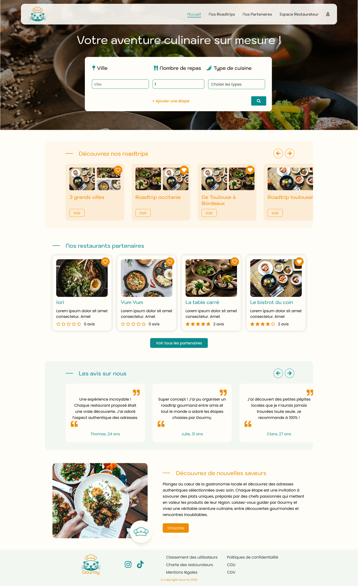
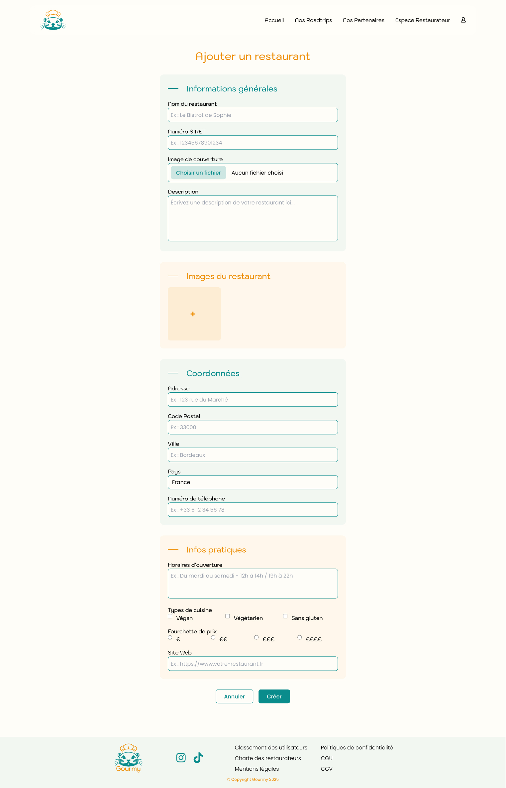
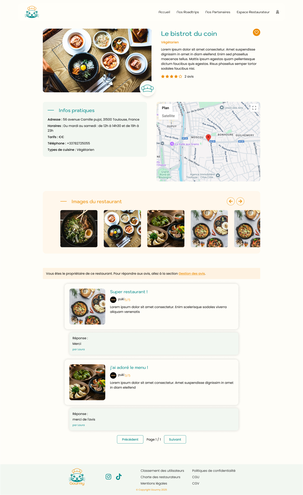
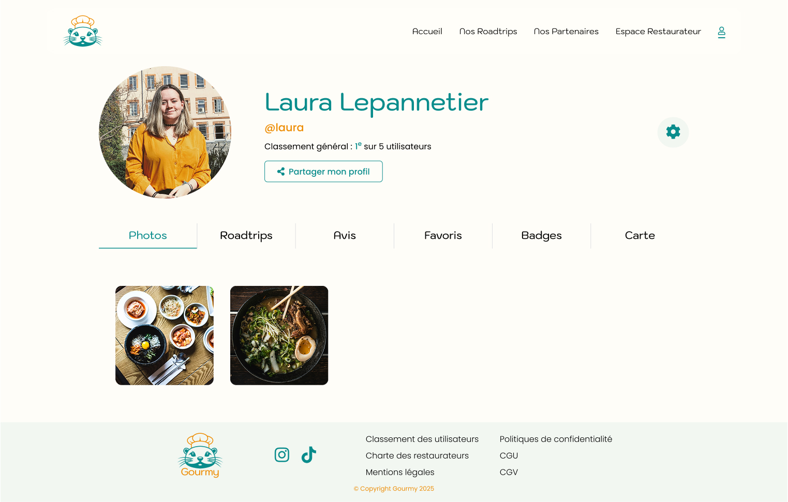
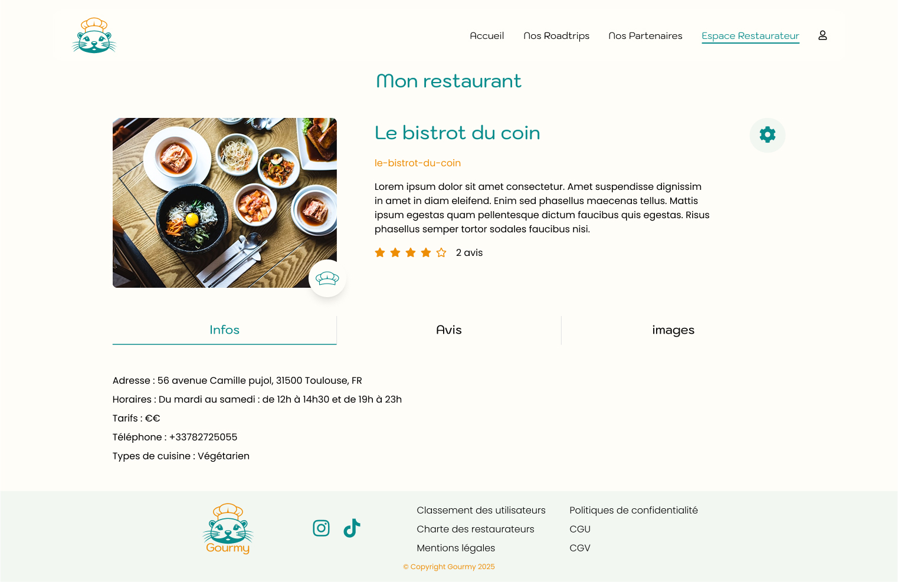
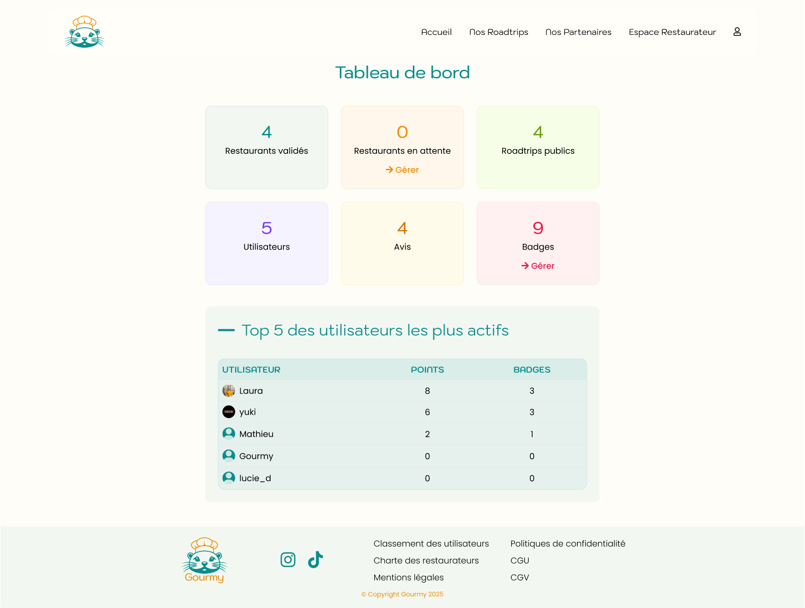

# Gourmy

**Gourmy** est une plateforme web permettant de **créer et partager des roadtrips culinaires** à travers la France.  
Les utilisateurs peuvent découvrir des **restaurants locaux**, **laisser des avis**, et **composer leurs propres itinéraires gourmands**.  
Les restaurateurs peuvent quant à eux **répondre aux avis**, **mettre à jour leurs informations**, et **valoriser leur engagement local**.

[lien du site](https://gourmy.lauralpn.fr)

---

## Fonctionnalités

1. **Gestion des utilisateurs**
   - Inscription et connexion (avec confirmation par email via Brevo).
   - Modification du profil (formulaires séparés par champ).
   - Accès à ses avis et à ses roadtrips depuis le tableau de bord.

2. **Restaurants**
   - Fiche complète avec description, type de cuisine, coordonnées, et images.
   - Carte interactive avec position géographique (API Google Maps).
   - Ajout d'avis et notes.
   - Réponses du restaurateur (uniquement accessibles depuis le profil du restaurateur).

3. **Avis et réponses**
   - Création, édition et suppression d’avis en temps réel (composant React avec Symfony UX).
   - Réponses du restaurateur affichées uniquement dans son tableau de bord.
   - Modales génériques pour confirmation ou édition (`<my-modal>`).

4. **Roadtrips**
   - Création via un formulaire dynamique avec étapes.
   - Chaque étape comprend une **ville**, un **type de cuisine** et un ou plusieurs **restaurants**.
   - Validation automatique si les restaurants d’une étape partagent le même type de cuisine.
   - Possibilité de réorganiser les étapes par **drag & drop**.
   - Affichage de toutes les étapes sur une **carte interactive**.

5. **Charte restaurateur**
   - Engagements pour les restaurateurs (produits locaux, durabilité, etc.).
   - Accessible via un formulaire dédié lors de l’inscription.

---

## Aperçu du projet

### Page d'accueil

### Page de connexion

### Page de création de restaurant

### Page d'un restaurant

### Espace utilisateur

### Espace restaurateur

### Espace administrateur

---

## Technologies

 - Symfony 7.1
 - Docker + Caddy
 - Doctrine ORM
 - TailwindCSS (via Asset Mapper)
 - PostgreSQL
 - Google Maps API

---

 ## Auteure
 👩‍💻 Laura Lepannetier
Projet réalisé dans le cadre du Mastère Tech Lead.

[GitHub](https://github.com/laura-lpn)
